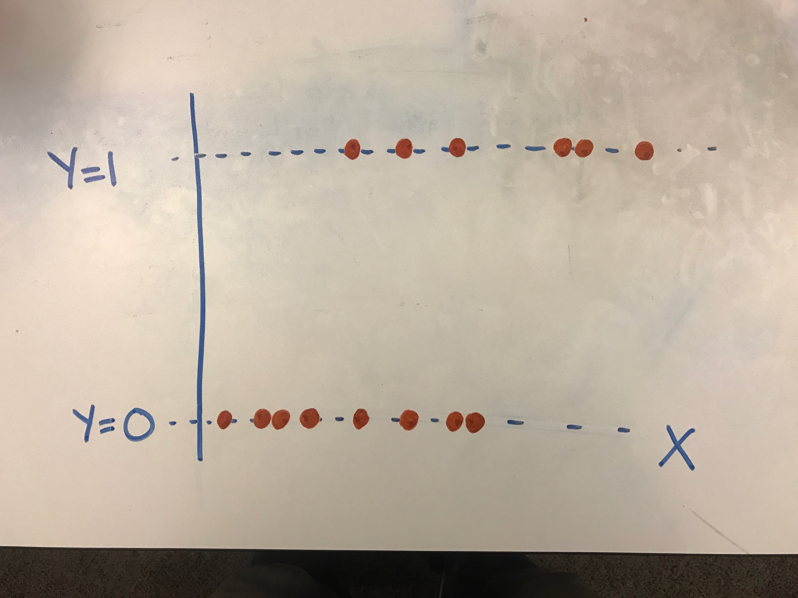
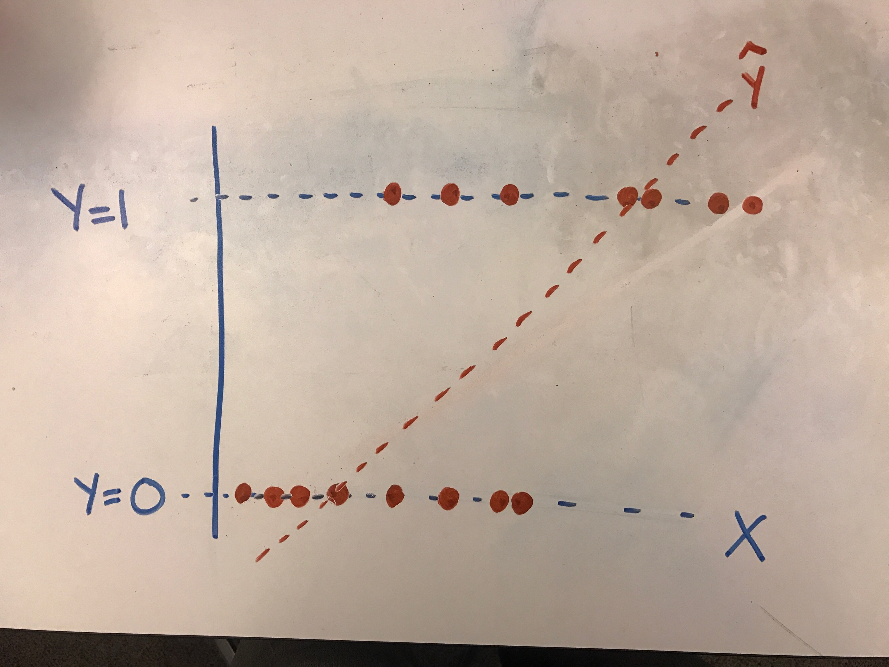
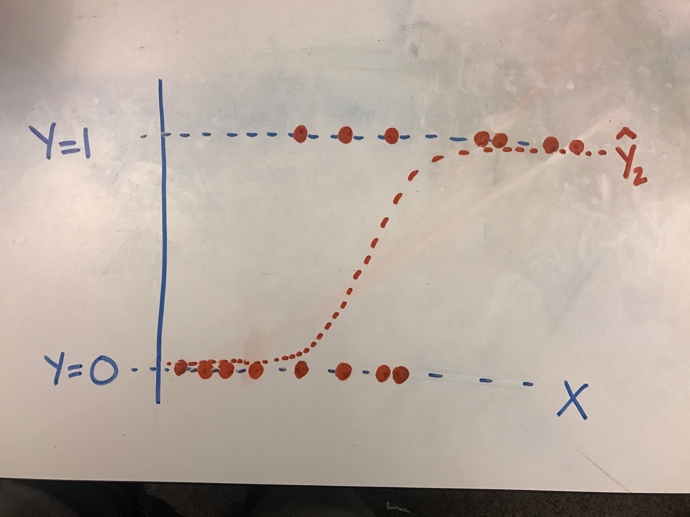
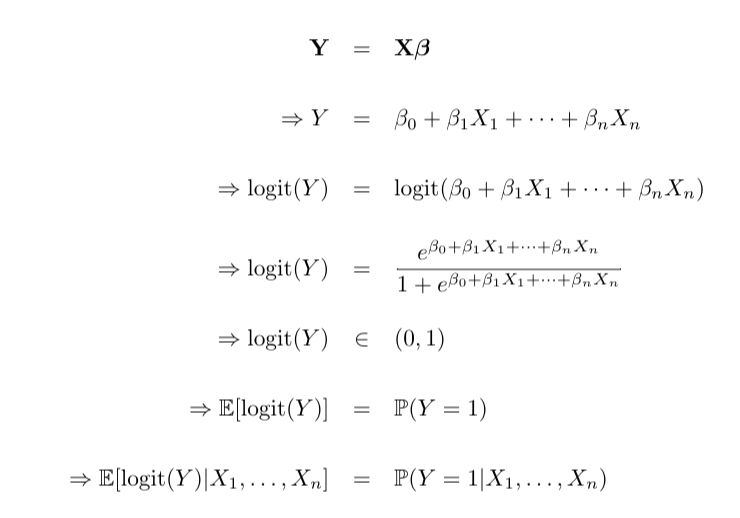

#  Introduction to Logistic Regression
Week 4 | Lesson 4.03

### LEARNING OBJECTIVES
*After this lesson, you will be able to:*
- Define logistic regression
- Explain the math behind logistic regression
- Build logistic regression models using statsmodels

---

<a name="introduction"></a>
## Introduction: Logistic Regression  (25 mins)

Suppose we have a dataset with two variables in it: one variable we seek to predict (Y) and one independent variable (X) we want to use in order to predict Y. What we would have done previously is to pick a metric (usually mean squared error) and then fit a line of best fit.

**However, what if Y is binary?**

After turning our binary variable into a dummy variable appropriate for use in Python, our plot might look something like this.



If we were to fit a traditional line through it, we'd likely get a line that fits as follows:



Are there any problems associated with this?

Wouldn't it be swell to get a line that looked like this?



Logistic regression is a linear approach to solving a binary classification problem. That is, we can use a linear model, similar to linear regression, in order to estimate the probability that an observation falls into a particular category and, based on this probability, provide a "best guess" for in which category the observation likeliest falls.

## What is Logistic Regression? A *Short* Definition

Logistic regression measures the relationship between the dependent data point variables and one or more independent data points by estimating probabilities.

The goal of logistic regression is to predict the probability that Y is equal to 1 (rather than 0) given certain values of X. That is, if X and Y have a positive linear relationship, the probability that a person will have a score of Y = 1 will increase as values of X increase. Our model's goal is predicting probabilities - rather than target scores - with our independent variables. Once we get these predicted probabilities, we can classify observations as falling into one category or the other based on the predicted probability.

For example, we might try to predict whether or not small businesses will succeed or fail based on the number of years of experience the owner has in the field prior to starting the business. We presume that those people who have been selling widgets for many years who open their own widget business will be more likely to succeed.

That means that as X (the number of years of experience) increases, the probability that Y will be equal to 1 (success in the new widget business) will tend to increase..

### Intuition Behind Logistic Regression

The intuition behind logistic regression is to transform the output of a linear regression (Y) which generally can be any value, to a range appropriate for probability - that is, anywhere between 0 and 1. 

The specific transformation used to "bend" our linear regression line is called the logit and gives rise to the name "logistic regression." It can predict values between 0 and 1, but does not include either.



(For more on why probability practically cannot be absolute, see: http://lesswrong.com/lw/mp/0_and_1_are_not_probabilities/)

## *Some* of the Math behind Logistic Regression

Logistic regression is only appropriate when the dependent variable is binary; for example, when something can be coded as `0` or `1`

##### Binary expected value and odds ratios

When Y is binary, the expected value of Y is equivalent to the probability that Y equals 1, as we discussed above.

Probability is sometimes expressed as odds which is simply the probability of one event or category divided by 1 - that probability. (In horse racing the odds = P(winning) / P(losing) = P(winning) / (1-P(winning)).)

Suppose the probability of having lung cancer given that you smoke at least one pack of cigarettes a day is 25% and the probability of having lung cancer given that you do not smoke at least one pack of cigarettes a day is 5%.

Then:
- The odds of having cancer given that you smoke is 25% / 75% or 1/3.
- The odds of having cancer given that you do not smoke is 5% / 95% or 1/20.
- The odds ratio is 1/3 / 1/20 = 20/3 = 6.67.
- We interpret this as "You are 6.67 times more likely to have lung cancer given that you smoke at least one pack of cigarettes a day."

The coefficients beta_1, beta_2, ... are equal to the log of the odds ratio, so raising e to the power of beta_1 will give you the odds ratio associated with a one-unit change in X_1. (Sometimes people use log-odds ratios but odds ratios are generally more easily interpreted.)

Note that your coefficients can take on any value - positive, negative, zero, whatever - but our predicted Y value is now bound between 0 and 1. This is very convenient!

## Recap & Review

Check: What is logistic regression?

Check: What is important about the dependent variable for logistic regression?

#### Goals of Logistic Regression

The goal of logistic regression is to find the best fitting model to describe the relationship between the characteristic of interest (dependent variable = response or outcome variable) and a set of independent (predictor or explanatory) variables. Logistic regression generates the coefficients (and its standard errors and significance levels) of a formula to predict a logit transformation of the probability of presence of the characteristic of interest.

Logistic Regression is quite simple. Specify the column containing the variable you're trying to predict followed by the columns that the model should use to make the prediction.

We will use a dataset of chemical properties of wines to predict those that are high quality or not.

<a name="guided-practice"></a>
## Guided Practice: Topic (50 mins)

Use the following Python code to demonstrate logistic regression.  We will utilize the formula syntax of `statsmodels` to automatically create dummy columns.

```python
import statsmodels.formula.api as sm
import pandas as pd


df = pd.read_csv("https://s3.amazonaws.com/demo-datasets/wine.csv")

model = sm.logit(
    "high_quality ~ residual_sugar + pH + alcohol",
    data = df
).fit()

model.summary()
```

**Check: Understanding of dummy variables and summary table.**

Let's check out the [Starter Code](./starter-code.ipynb):

<a name="conclusion"></a>
## Conclusion (5 mins)
- Logistic regression is a classification algorithm with similar properties to linear regression
- It is very fast and efficient and is by far the most common classification algorithm
- The coefficients in a logistic regression model represent the change in log-odds due to the input variables

### ADDITIONAL RESOURCES
- [Logistic Regression Video Walkthrough](https://www.youtube.com/watch?v=zAULhNrnuL4&noredirect=1)
- [Logistic Regression Walkthrough](http://www.mc.vanderbilt.edu/gcrc/workshop_files/2004-11-12.pdf)
- [Logistic Regression w/ Statsmodel - Well Switching in Bangledesh](http://nbviewer.ipython.org/urls/raw.github.com/carljv/Will_it_Python/master/ARM/ch5/arsenic_wells_switching.ipynb)
- [Odds Ratio Explanation](http://www.wright.edu/~thaddeus.tarpey/ES714glm.pdf)
