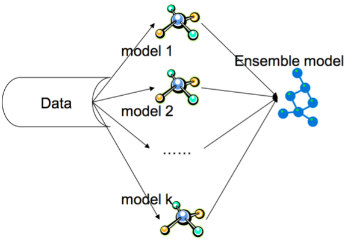
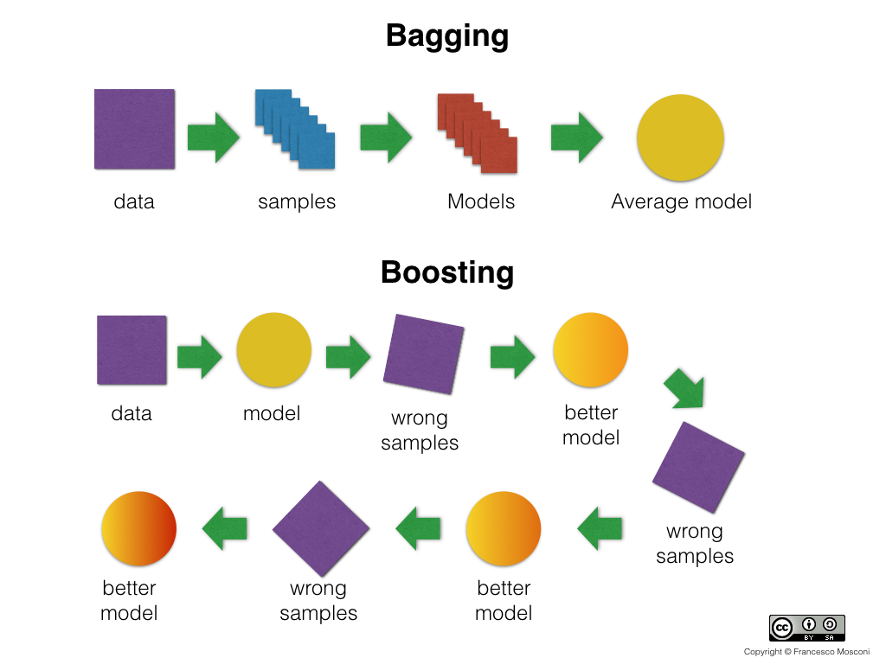

#  Ensemble Methods - Random Forests and Boosting
Week 6 | Lesson 6.05

### LEARNING OBJECTIVES
*After this lesson, you will be able to:*
- Explain what a Random Forest is and how it is different from Bagging of decision trees
- Explain what Extra Trees models are
- Apply both techniques to classification
- Describe Boosting and how it differs from Bagging
- Apply Adaboost and Gradient Boosting to classification problems

<a name="opening"></a>
## Opening

**Check:** What happens when you combine bagging with decision trees? Recall some observations from the past labs and lessons.

Today we will learn about random forests, which are essentially a variation of the bagging + decision tree model. We will also learn about a different ensemble technique called _boosting_ and we will compare it with _bagging_. 

<a name="introduction"></a>
## Introduction to Random Forests

Random Forests are some of the most widespread classifiers used.  They are
relatively simple to use because they require very few parameters to set and
they perform pretty well. As we have seen, Decision Trees are very powerful
machine learning models.

**Check:** What are the main advantages of decision trees?

On the other hand Decision Trees have some limitations, in particular, trees that are grown very deep tend to learn highly irregular patterns: they overfit their training sets. Bagging helps mitigate this problem by exposing different trees to different sub-samples of the whole training set.

Random forests are a further way of averaging multiple deep decision trees, trained on different parts of the same training set, with the goal of reducing the variance. This comes at the expense of a small increase in the bias and some loss of interpretability, but generally greatly boosts the performance of the final model.



**Check:** Describe how the bagging algorithm works.

_Random forests_ differ from bagging decision trees in only one way: they use a modified tree learning algorithm that selects, at each candidate split in the learning process, a **random subset of the features**. This process is sometimes called _feature bagging_. The reason for doing this is the correlation of the trees in an ordinary bootstrap sample: if one or a few features are very strong predictors for the response variable (target output), these features will be selected in many of the bagging base trees, causing them to become correlated. By selecting a random subset of the features at each split, we counter this correlation between base trees, strengthening the overall model.

**Check:** Recall what are the two properties base models must satisfy in order for bagging to work well.

For a problem with p features, it is typical to use:
- p^(1/2) (rounded down) features in each split for a classification problem.
- p/3 (rounded down) with a minimum node size of 5 as the default for a regression problem.

### Extremely Randomized Trees
Adding one further step of randomization yields extremely randomized trees, or _ExtraTrees_. These are trained using bagging and the random subspace method, like in an ordinary random forest, but an additional layer of randomness is introduced. Instead of computing the locally optimal feature/split combination (based on, e.g., information gain or the Gini impurity), for each feature under consideration, a random value is selected for the split. This value is selected from the feature's empirical range (in the tree's training set, i.e., the bootstrap sample), in other words, the top-down splitting in the tree learner is randomized.

<a name="guided-practice"></a>
## Guided Practice: Random Forest and ExtraTrees in Scikit Learn (20 min)

Scikit Learn implements both random forest and extra trees methods as part of the `ensemble` module.

First have a look at the [documentation](http://scikit-learn.org/stable/modules/ensemble.html#forest). (5 min).

**Check:** What parameters did you notice? Any questions on those?

Let's load the [car dataset](https://archive.ics.uci.edu/ml/machine-learning-databases/car/).


```python
import pandas as pd
df = pd.read_csv('./assets/datasets/car.csv')
df.head()
```


<div>
<table border="1" class="dataframe">
  <thead>
    <tr style="text-align: right;">
      <th></th>
      <th>buying</th>
      <th>maint</th>
      <th>doors</th>
      <th>persons</th>
      <th>lug_boot</th>
      <th>safety</th>
      <th>acceptability</th>
    </tr>
  </thead>
  <tbody>
    <tr>
      <th>0</th>
      <td>vhigh</td>
      <td>vhigh</td>
      <td>2</td>
      <td>2</td>
      <td>small</td>
      <td>low</td>
      <td>unacc</td>
    </tr>
    <tr>
      <th>1</th>
      <td>vhigh</td>
      <td>vhigh</td>
      <td>2</td>
      <td>2</td>
      <td>small</td>
      <td>med</td>
      <td>unacc</td>
    </tr>
    <tr>
      <th>2</th>
      <td>vhigh</td>
      <td>vhigh</td>
      <td>2</td>
      <td>2</td>
      <td>small</td>
      <td>high</td>
      <td>unacc</td>
    </tr>
    <tr>
      <th>3</th>
      <td>vhigh</td>
      <td>vhigh</td>
      <td>2</td>
      <td>2</td>
      <td>med</td>
      <td>low</td>
      <td>unacc</td>
    </tr>
    <tr>
      <th>4</th>
      <td>vhigh</td>
      <td>vhigh</td>
      <td>2</td>
      <td>2</td>
      <td>med</td>
      <td>med</td>
      <td>unacc</td>
    </tr>
  </tbody>
</table>
</div>


This time we will encode the features using a One Hot encoding scheme, i.e. we will consider them as categorical variables. We also need to encode the label using `LabelEncoder`.


```python
from sklearn.preprocessing import LabelEncoder
y = LabelEncoder().fit_transform(df['acceptability'])
X = pd.get_dummies(df.drop('acceptability', axis=1))
```

We would like to compare the performance of the following 4 algorithms:

- Decision Trees
- Bagging + Decision Trees
- Random Forest
- Extra Trees

Note that in order for our results to be consistent we have to expose the models to exactly the same Cross Validation scheme. Let's start by initializing that.


```python
from sklearn.cross_validation import cross_val_score, StratifiedKFold
from sklearn.tree import DecisionTreeClassifier
from sklearn.ensemble import RandomForestClassifier, ExtraTreesClassifier, BaggingClassifier

cv = StratifiedKFold(y, n_folds=3, shuffle=True, random_state=41)
```

Now let's initialize a Decision Tree Classifier and evaluate its performance:


```python
dt = DecisionTreeClassifier(class_weight='balanced')
s = cross_val_score(dt, X, y, cv=cv, n_jobs=-1)
print "{} Score:\t{:0.3} ± {:0.3}".format("Decision Tree", s.mean().round(3), s.std().round(3))
```

    Decision Tree Score:	0.962 ± 0.008


### Your turn now:

Initialize the following models and check their performance:
- Bagging + Decision Trees
- Random Forest
- Extra Trees

You can also create a function to speed up your work...


<a name="introduction_2"></a>
## Intro to Boosting (15 min)

With bagging and random forests we train models on separate subsets and then combine their prediction. In a sense we are parallelizing the training and then combining (like a map-reduce).

_Boosting_ is a different ensemble technique that is sequential.



Boosting is an iterative procedure that adaptively changes the sampling distribution of training records at each iteration in order to correct the errors of the previous iteration of models. The first iteration uses uniform weights (like bagging) for all samples. In subsequent iterations, the weights are adjusted to emphasize records that were misclassified in previous iterations. The final prediction is constructed by a weighted vote (where the weights for a base classifier depends on its training error).

Since the base classifier's focus more and more closely on records that are difficult to classify as the sequence of iterations progresses, they are faced with progressively more difficult learning problems.

Boosting takes a base _weak_ learner and tries to make it a _strong_ learner by re-training it on the misclassified samples.

There are several algorithms for boosting, in particular we will mention `AdaBoost`, `GradientBoostingClassifier` that are implemented in scikit learn.


### AdaBoost and Gradient Boosting Classifier

`AdaBoost` refers to a particular method of training a boosted classifier. A boost classifier is a classifier in the form F_T(x) = \sum_{t=1}^T f_t(x) where each f_t is a weak learner that takes an object $x$ as input and returns a real valued result indicating the class of the object. These weak learners are aggregated to make a strong classifier.

[This presentation](http://www.ccs.neu.edu/home/vip/teach/MLcourse/4_boosting/slides/gradient_boosting.pdf) visually shows an example of AdaBoost at work and how AdaBoost laid the groundwork for Gradient Boosting Classifier.

Gradient Boosting Classifier is a generalization of boosting to arbitrary differentiable loss functions. The intuition behind this mechanism is to:
- Fit a model F to the data.
- Look at the difference between our observed y and our model F. (The y_i - F(x_i) can be thought of as residuals!)
- Fit a second model F_2 to (roughly) the residuals y_i - F(x_i).
- Aggregate your model F and F_2.
While we won't get into the details here, we can interpret residuals as negative gradients. By doing this, we can apply our gradient descent algorithm to optimize our loss and generalize this to many loss functions.

GBRT is an accurate and effective off-the-shelf procedure that can be used for both regression and classification problems. Gradient Tree Boosting models are used in a variety of areas including Web search ranking and ecology.

The advantages of GBRT are:
- Natural handling of data of mixed type (= heterogeneous features)
- Predictive power
- Robustness to outliers in output space (via robust loss functions)

The disadvantages of GBRT are:
- Scalability, due to the sequential nature of boosting it can hardly be parallelized.

<a name="ind-practice"></a>
## Independent Practice: Ada Boost and Gradient Boosting Classifier

Test the performance of the `AdaBoost` and `GradientBoostingClassifier` models on the car dataset. Use the code you developed above as a starter code.


<a name="conclusion"></a>
## Conclusion

In this class we learned about Random Forests, Extremely randomized trees and Boosting. They are different ways to improve the performance of a weak learner.

Some of these methods will perform better in some cases, some better in other cases. For example, Decision Trees are more nimble and easier to communicate, but have a tendency to overfit. On the other hand Ensemble methods perform better in more complex scenarios, but may become very complicated and harder to explain.
Have a look [here](https://www.wise.io/resources) for a couple of examples from real world startup Wise.io.

**Check:** Can you think of what could be limitations of these methods?
> Answer:
- They don't scale very well to large datasets, Boosting in particular
- They are black boxes

### ADDITIONAL RESOURCES

- [Random Forest on wikipedia](https://en.wikipedia.org/wiki/Random_forest)
- [Quora question on Random Forest](https://www.quora.com/How-does-randomization-in-a-random-forest-work?redirected_qid=212859)
- [Scikit Learn Ensemble Methods](http://scikit-learn.org/stable/modules/ensemble.html)
- [Scikit Learn Random Forest Classifier](http://scikit-learn.org/stable/modules/generated/sklearn.ensemble.RandomForestClassifier.html)
- [Academic intro to Adaptive Boosting](http://rob.schapire.net/papers/explaining-adaboost.pdf)
- [Stack Exchange AdaBoost vs Gradient Boosting](http://stats.stackexchange.com/questions/164233/intuitive-explanations-of-differences-between-gradient-boosting-trees-gbm-ad)
- [Gentle intro to Gradient Boosting](http://www.ccs.neu.edu/home/vip/teach/MLcourse/4_boosting/slides/gradient_boosting.pdf)
- [Quora on intuitive explanations of Adaboost](https://www.quora.com/What-is-AdaBoost)
- MIT on [adaptive boosting](http://math.mit.edu/~rothvoss/18.304.3PM/Presentations/1-Eric-Boosting304FinalRpdf.pdf)
- A lighter [math introduction](http://www.ccs.neu.edu/home/vip/teach/MLcourse/4_boosting/slides/gradient_boosting.pdf) to AdaBoosting and Gradient Boosting h/t Charlie
- A [walkthrough](https://www.analyticsvidhya.com/blog/2016/02/complete-guide-parameter-tuning-gradient-boosting-gbm-python/) on tuning GBM h/t Sheena

