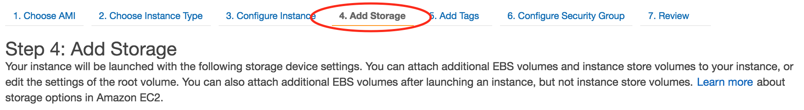
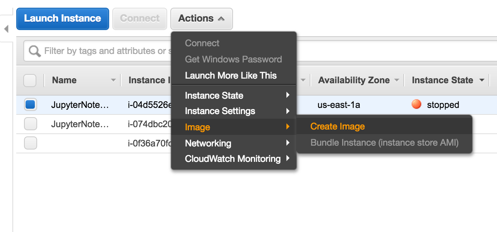
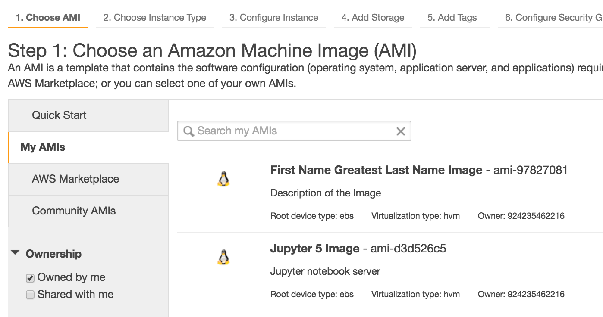

# Duplicating an AWS Instance

First off lets clear up some confusion of how we would go about doing this.

### Snapshots vs. Images
**Snapshots**
- Virtual machine snapshots are file-based snapshots of the state, disk data, and configuration of a virtual machine at a specific point in time. You can take multiple snapshots of a virtual machine, even while it is running. You can then revert the virtual machine to any of the previous states by applying a snapshot to the virtual machine.
>- We can think of these as commits in git hub speak.  In the sense of we can revert our branch to a previous commits state.
>- More about them here https://technet.microsoft.com/en-us/library/dd851843(v=ws.11).aspx

**Images**
- A Disk image is a computer file containing the contents and structure of a disk volume or of an entire data storage device, such as a hard disk drive, tape drive, floppy disk, optical disc or USB flash drive. A disk image is usually made by creating a sector-by-sector copy of the source medium, thereby perfectly replicating the structure and contents of a storage device independent of the file system.
>-If you remember back when we set up our AWS Instance there was an aspect of adding storage.  This is what we're making an image of, as this storage drive houses our OS and anything else we may have installed on our VM such as Anaconda or SQl Server.
-----

-----
>- When we launch our instance we select a default 'Amazon Machine Image'.  These are essentually disk images that Amazon has already taken with specific OS and maybe a few applications that they let everyone use.
>- Because Operating systems and applications are systems and series of files they need a storage device to be stored in as the RAM and CPU and/or GPU are not going to do this.

-----

_Typically when we are trying to duplicate an Instance or recreate one we are trying to put the OS and settings we have on a more or less powerful Virtual Machine which we would differntiate between in the 'Choose Instance Type'._

-----

### Creating a Disk Image
Creating an image in AWS is as simple as 1,2,3....
- In the AWS Management Console Select the instance you want to create an image of.
- 'Actions' -> 'Image' -> 'Create Image'
- Name the image and give it a description if you desire.
- Wait for your image to be approved and created. (This could take seconds or hours depending on size and Queue)

Great!  Now you have your own AMI to use forever and ever!

-----

### Image Duplication
Now that we have our own custom AMI we can use it as the base to a new AWS Instance.
- Go to you in your AWS Console go to your EC2 Management Environment.
- Select 'Instances' -> 'Launch Instance' (Just like you have been doing).
- Instead of using 'Quick Start', select 'My AMIs' on the left hand side.
>- Here you should see the AMI(s) you created and so you can selecte the once you want to use to create a new instance.

-----

Follow through with the rest of the process like you have done before.

**Bada-Bing! Bada-Boom!**
You have a new Instance that is just like one you already set up.

_It will most likely be in the 'Choose Instance Type' part that your new Instance/VM will differ from your previous one because you want to add more or less computing power_
