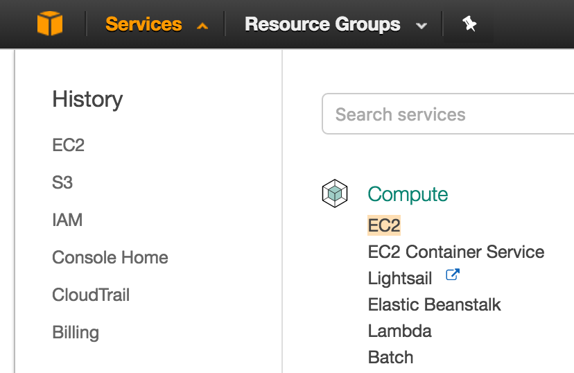
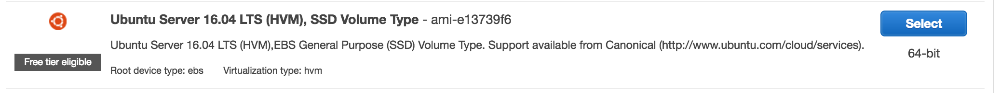
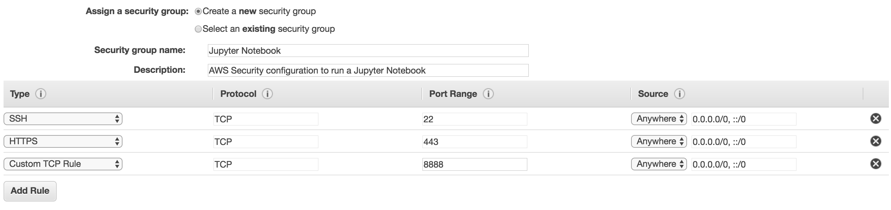
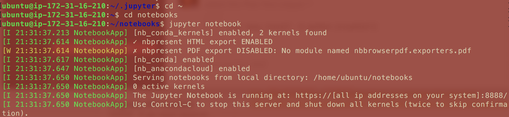
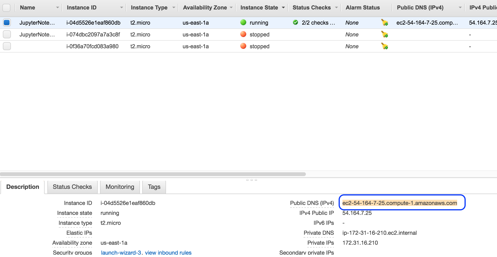
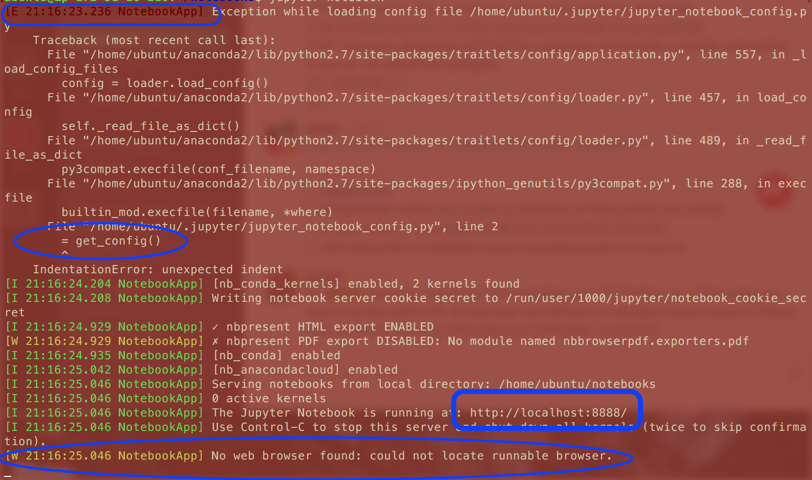

# Additional Notes: Setting up a Jupyter Notebook on AWS
#### Based on Chris Albon's Guide. http://chrisalbon.com/jupyter/run_project_jupyter_on_amazon_ec2.html

-------


**Creating the new EC2 instance**

In order to create an EC2 instance you will need to create an Amazon Web Services Account.
https://aws.amazon.com/  
Even though we are going to example with free tier things you will still need to provide credit card information in order to finished registering your account.  

Once you're in the Amazon Web Services Console click on 'EC2' under the 'Compute' group.


In the EC2 Sub Console/dashboard (whatever you want to call it) you should see a big blue button 'Launch Instance'.  
We'll Now configure the instance.
- **Choose AMI** : Free Teir Ubuntu server  


- **Choose Instance Type** : Use the default free tier.
> - I only recommend setting up a paid instance once you have experimented with a free tier version and have everything ironed out (so to speak).  You can take the state of your Instance later and copy it onto a much more powerful instance by using the Amazon Machine Imaging.  (The guide for this should be in this folder)

- **Configure Instance** : No action required
> - The options on this page allow for customer network configurations, permissions as well as some miscellaneous settings

- **Add Storage**. : _Optional_ Up the storage to 30gb (The maximum Free amount)
> - This is the hard drive that is directly attached the the compute instance.  Where the OS and applications live.  If we were to think of this as a normal computer the EC2 Instance is the CPU/GPU and RAM, EC2 Storage is the local hard drive (:C drive) and the S3 is like an external Hard drive.  

- **Add Tags** : Name the Instance something relevant to yourself and its use.

### _Important_
- **Configure Security Group** : Follow the below image.  You can name the group and describe it however you want.   

  - **SSH** : This allows your computer and anyone connected to your computer access to the VM.
  - **HTTPS** : In the event that your instance runs a web page this allows those users who meet SSH requirements to access your instance via a web page.  As Jupyter notebook servers run on a local web page this will allow us to view them.
  - **Customer TCP Rule** : 'Transmission Control Protocol', essentially the rules by which a connection will establish and execute.  We set it to 8888 as that is the default for the Jupyter notebook

SSH allows authorized users to access the VM terminal once there when we spin up a jupyter notebook there is not browser in our vm to display the notebook so we have to create a tunnel from our computers browser to the VM.  We need the HTTPS to all our browser on our machine to connect to the VM and we use the custom TCP rule to state that the port that will outbound communication to our browser will be 8888, the one Jupyter notebook runs on.


- **Review** : Review and Launch the Instance.
  * Once you launch you will be prompted to use or create a new key. Name this key without using spaces or special characters for ease of use and save/download it somewhere that is easy for your to remember/access (say your desktop)
I named mine stuff like 'ASWJupyter4' and saved it to my desktop.
  * If you click 'Launch', your instance will launch and you just need to connect to it in your terminal.
  * Or you can just use an existing Pem Key you have laying around.


### Connecting to your Instance  

**Local Prep**
There are a few things we are going to have to do before we can connect to our instance.
Change the security settings on YOUR pem key.

```bash
chmod 400 ASWJupyter4.pem
```  
Make sure we have PuTTY for interacting with SSH keys.  
```bash
brew install putty
```

**Connecting to the Instance**
In your AWS interactive console if you select your instance and then click 'Connect' you will get a window of information of how to connect including a tidbit about changing the security setting using chmod 400.

And will give you (mostly) what you need to execute the connection to your instance.  You can copy and paste the Example SHH code directly into your terminal and execute.

```bash
ssh -i "AWSJupyter40.pem" ubuntu@ec2-54-90-187-245.compute-1.amazonaws.com
```

- Pay close attention to your pem key name that AWS provides and make sure it matches yours.
- Make sure you are in the same directory as the pem key or including the necessary file path to get to it.
_Having pem on your desktop and having your CWD set to desktop will make this easier._


**Possible issues when Connecting to the Instance**
Initially I got a "Permission Denied(PublicKey)" issue.
http://docs.aws.amazon.com/AWSEC2/latest/UserGuide/TroubleshootingInstancesConnecting.html#TroubleshootingInstancesConnectingMindTerm

My issue was that I was inputting the wrong information.

Amazon was telling me to use
```bash
'ssh -i "AWS Jupyter 4.0.pem" ubuntu@ec2-54-159-37-31.compute-1.amazonaws.com'
```
however I needed to use
```bash
'ssh -i "AWSJupyter40.pem" ubuntu@ec2-54-159-37-31.compute-1.amazonaws.com'
```
as the pem file had a different name on my desktop.  Hence why we wanted to avoid spaces and special characters when we named our pem key.

### Prepping your Instance for Jupyter

**Installing Anaconda**
Copy the link to the **Linux** 64 bit installer and 'wget' it.

Bash install it

```bash
wget https://repo.continuum.io/archive/Anaconda2-4.2.0-Linux-x86_64.sh

bash Anaconda3-4.2.0-Linux-x86_64.sh

```

You're going to have to scroll through some agreements (You can hold 'Enter' or the space bar to scroll through).

Enter 'yes' when prompted, there is also a time you have to hit 'Enter' to continue.

**Set Anaconda as the preferred environment**
```bash
which python /usr/bin/python

source .bashrc
```

Which Python will set your default python version.

**Create a password for jupyter notebook**

We kind of made on open connection to our server via the jupyter notebook and we want to protect it so unauths can't access our resources via our Jupyter notebook.  That is why we're going to create a password for it.


```bash
IPython # Will jump into an iPython shell

from ipython.lib import passwd # Import the passwd function from ipython

passwd() # will prompt use to set a password
```

Once you enter a password and confirm it you will get a hashed(Encrypted) password returned.  Copy and paste this somewhere to save for later as we will need it.  It should look something like 'sha1:98ff0e110111:124828c719943a6eecd54b51c006b1050f0af1a62d'
```bash
exit
```
Exits the iPython shell

**Create config profile**
```bash
jupyter notebook --generate-config
```
This generates the Jupyter notebook configure file we will edit later.

**Create certificates for https**

```bash
mkdir certs

cd certs

sudo openssl req -x509 -nodes -days 365 -newkey rsa:1024 -keyout mycert.pem -out mycert.pem
```
_See the 'Quick and Dirty on SSL' at the end of this for more information on this statement_


**Configure jupyter**

Now we are going to edit the Jupyter Notebook configuration from earlier.

```bash
cd ~/.jupyter/ # change to the Jupyter Directory where the config vile is

vi jupyter_notebook_config.py # 'vi' allows you to edit the file at line 1

```

_'vi' is short for 'Visual Editor'_

You will enter the Visual Editor in Command mode, where each key on the keyboard has a different editing function. You will need to be in Insert mode in order to be able to add things. To do this, simply press 'i' on the keyboard and start inserting!

Copy and paste that whole block of text in.  Be very careful here as missing some of the aspects of this code or adding random characters will cause issues when you go to execute this file when Jupyter Notebook is run/opened.

---
```bash
c = get_config()

# Kernel config
c.IPKernelApp.pylab = 'inline'  # if you want plotting support always in your notebook

# Notebook config
c.NotebookApp.certfile = u'/home/ubuntu/certs/mycert.pem' #location of your certificate file
c.NotebookApp.ip = '*'
c.NotebookApp.open_browser = False  #so that the ipython notebook does not opens up a browser by default
c.NotebookApp.password = u'sha1:98ff0e580111:12798c72623a6eecd54b51c006b1050f0ac1a62d'  #the encrypted password we generated above
# It is a good idea to put it on a known, fixed port
c.NotebookApp.port = 8888
```
---


Be sure to change the 'c.NotebookApp.password' to your hashed password from earlier.


'esc' to stop insert mode

'Shift'+'Z'  twice to exit the file.

---

**Create folder for notebooks**

This is kinda of unecessary, but makes a good place to house all your jupyter notebook files
```bash
cd ~ # Changes back to the base directory

mkdir Notebooks; cd Notebooks # You can make an change directories in one line with ';'
```

-----


**Create new screen**
also unecessary

```bash
screen # starts a new terminal screen, clearing previous output
```

----

**Start Jupyter notebook**

```bash
jupyter notebook
```

Pay close attention to the output scripts from when you start the notebook.

If your notebook is running smoothly you should have an output like the one directly below.



If it doesn't see the block at the end 'Issues Opening Jupyter Notebook'
---
**Visit Jupyter notebook in browser**

Remember back to that snapshot of when our Jupyter notebook was running properly?
- Specifically this "https://[ip addresses on your system]:8888/"

All those 'Ip addresses on our system' can be found on our AWS console.





Copy and paste that chunk into our prompt from opening the Jupyter Notebook to get something like...

https://ec2-52-39-239-66.us-west-2.compute.amazonaws.com:8888/

Visit that URL in your browser:

Google will say something along the lines of 'this is not secure'.  Just click 'Advanced' and allow it.

Once that goes through you should not have a Jupyter notebook prompt for a password.  Provide the password you set (not the hashed gibberish password).

**BOOM!** You're In!!!


###Issues Opening Jupyter Notebook

If you see something like what is below, you will probably have to go back to the jupyter_notebook_config.py file.


- **Top Left** - Lets you know there was an issue.
- **Middle Left** - Lets you know where the issue is, if you go and cross reference with what we put in the jupyter_notebook_config.py you will see we left out the variable 'c' that gets assigned the 'get_config()'.
- **Bottom Right** - Your notebook should say its running at "https://[all ip addresses on your system]:8888/" not the single localhost
- **Bottom** - This line is letting us know that our line "c.NotebookApp.open_browser = False" is not being executed.  Maybe because the script earlier is breaking before it can get to it or some aspect of this part is wrong (in this situation it is because the script the .py file is breaking before this is executed.


###Quick and Dirty on SSL

**sudo openssl** -
The openssl program is a command line tool for using the various cryptography functions of OpenSSL's crypto library from the shell. It can be used for
o  Creation and management of private keys, public keys and parameters
o  Public key cryptographic operations
o  Creation of X.509 certificates, CSRs and CRLs
o  Calculation of Message Digests
o  Encryption and Decryption with Ciphers
o  SSL/TLS Client and Server Tests
o  Handling of S/MIME signed or encrypted mail
o  Time Stamp requests, generation and verification


**req -x509**
o  Pretty much generates a certificate describing the rest of the SSL and its settings.
**-nodes**
"no DES". When given as an argument, it means OpenSSL will not encrypt the private key
**-days 365**
o  make this key valid for 1 year, after which it's not to be used any more

**-newkey rsa:1024**
Generate a new key and certificate (self sign) rsa:1024 is the level of encryption.

**-keyout mycert.pem**
o Contains the private key for the server.  The private key is used as input in the command to generate a Certificate Signing Request (CSR).
**-out mycert.pem**
o Puts the SSL Certificate in the mycert.pem file.

Basically all the information gets put into the mycert.pem file.  


_When you run this command you will be asked to enter details to be entered into your CSR.(mycer.pem).  The information entered is know as the Distiguished Name and is associated with the keyout's CSR_
