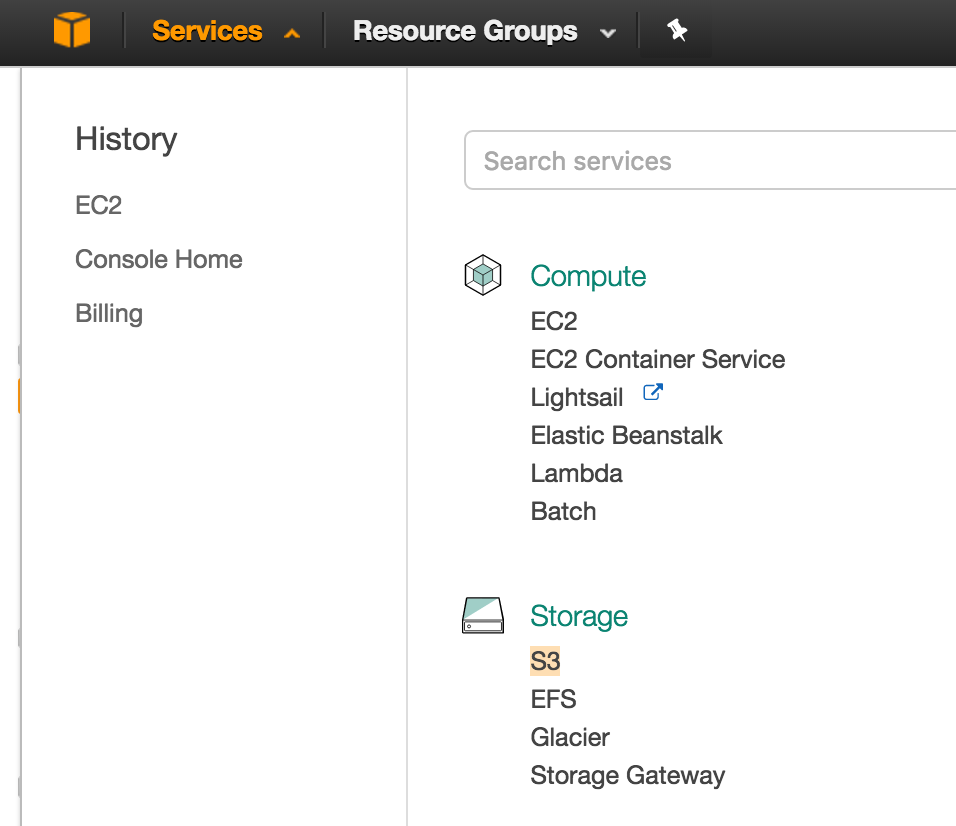
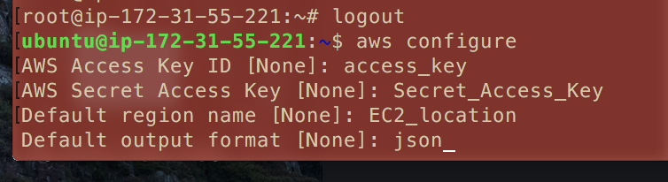
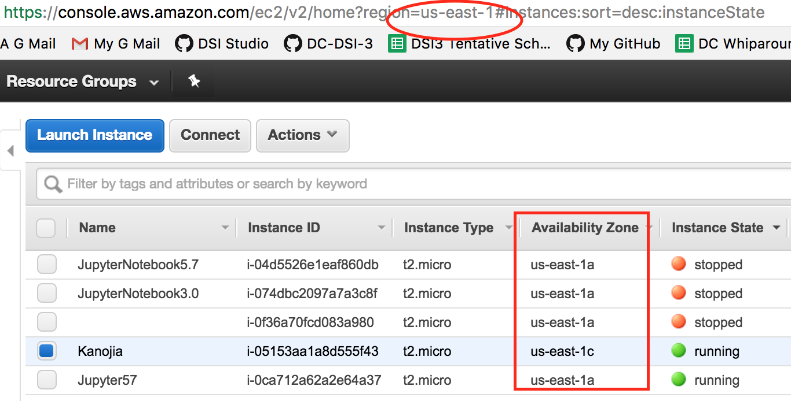

# Linking AWS EC2 to S3
------


AWS S3, or Simple Storage Service is basically an remote hard drive to store things.  We set up an EC2 instance to run processes our local devices can't bear the burden of, but most of those processes involve data.  We need to create a link from our EC2 instance to our data.  Naturally using an Amazon tunnel from and Amazon S3 to and Amazon EC2 would be the ideal thing to do.

**Note**
This linking, for the most part, follows the process laid down in the video below.  This video is outdated so you will notice that the the interactions with the AWS Management environment will be different from what you see.  Additionally the video uses a different operating system(Linux) than the one this guide goes along with(Ubuntu).
https://www.youtube.com/watch?v=Wd93A5Xqfmo


### Creating an AWS S3

From the AWS Console navigate to storage and select 'S3'

----

**'Create Bucket'**
For maximum transfer efficiency you will want to select a bucket closest to your EC2 instance.  (We don't want our data to have to fly all the way around the world to get processesed, now do we?)
They did not have any S3 buckets available in Northern Virginia (where my EC2 instance is) when I set this up, so I selected Ohio for my bucket location.

After naming the bucket and selecting the location your bucket will be live. Click on the bucket on the left to enter into the buckets console page.

You can click the big blue **'Upload'** button or **'Actions' -> 'Upload'** to upload files to your S3 bucket.

_S3 actually means 'Super Simple Stuff' not 'Simple Storage Services'_

------

### IAM Users
The users are like sub-accounts that can access your account (with specified abilities).  Rather than having to log in using your local SSH keys or your AWS management username and password on the internet, we can use these User credentials to access instances and environments from the command line.

In this situation we are going to create a user account which we will use to authenticate and connect to our S3 instance from our running EC2 instance. (You figured Amazon would have a much simpler way of doing so)

**User Creation**
On the 'Services' window of your Amazon AWS Console, Click on 'AIM' under 'Security, Identity & Compliance'.
To create a new user click 'User' (should be on the left hand side).
- 'Add user'
- Name it something relevant to what you will use it for
- Select 'Programmatic Access' as the Access Type.
- click 'Next:Permissions' -> 'Attatch existing policies directly' .
> - Select 'Administrator Access' and 'AmazonEC2FullAccess'
- click 'Next:Review' ,finally 'Create user'

The next page that appears should be one telling you that the user creation was a success and should have a button to download a CSV file.  This CSV contains the users credentials, including their Access Key and Secret Access Key which will be used later.

------

### Connecting the EC2 to the S3 via sync
_You may want to upload a sample file to your S3 to test the S3 to EC2 interaction._

Connect to your EC2 instance.

**Sudo Mode**
Run everything from sudo state.
```bash
sudo -i
```

_Keep inmind this later_

**'ctrl'+'d' will leave sudo mode**

-----

This is where we start to diverge from the video because of our server type.
_Keep in mind that this guide was created to complement a guide that set up a Jupyter Notebook server on an EC2 Ubuntu instance._

**Amazon Command Line Interface (CLI)**
We will be using the Amazon Command Line for this connection, if you haven't already done so install it on your instance
```bash
apt install python-pip # If you dont have pip, but you probably do

pip install awscli # for the AWS Command Line Interface
#or
apt install awscli
```

----

**Apache2 Install**

The video does something like 'yum install httpd', which is a linux library, however in this circumstance we are using a Ubuntu server which uses the apache2 package for the same tasks.

```bash
apt install apache2
```

----

**User Configuration**

We need to configure this VM using AWS Command Line Interface so that it can act like the user we set up earlier.

```bash
aws configure
```
This should result in a prompt asking your for some information


-----

The AWS Access key and Secret Access Keys can be found on the credential CSV we downloaded when we created a user with permissions.

The Region Name should match the one that your EC2 instance is running out of.  You can check in your EC2 dashboard.


-----

** Optional: Test File**
If you're following along with the video now is the time that we catch up to the user testing their connection.

They create a file as an example to show data being moved from the EC2 to the S3.
```bash
# Change to a directory.
cd /var/www/html/

touch index.php # Creates a new empty file

echo "Hello S3" > index.php # Writes the following contents into the indicated file

cat index.php # reads contents of the file.
```
-----

**S3 Sync**
Syncing files is as simple as 'aws s3 sync'

```bash
# If you're in the sudo state
aws s3 sync /var/www/html/ s3://bucket_name

# If you're not in the sudo state (aka Normal Mode)
sudo aws s3 sync /var/www/html/ s3://bucket_name
```

The "aws s3 sync" syncs the first file(on the VM) to the second file(The S3)
This essentually pushes all the files from the first specified directory(EC2) to the second specified directory(S3).

Switch the order to move files from S3 to EC2
```bash
aws s3 sync  s3://bucket_name /var/www/html/
```

-----

### Congratulations!!!
Now you have a path by which you can move files between your EC2 and S3, of course there is the addition of another command to manually move files, but meh...

----

**Real Talk:**
- I highly recommend using the '/var/www/html' directory (just like the video) as the directory you use to sync to your S3.  As this directory is on the root it is easy to access in a jupyter notebook, no matter what directory the notebook is in.
```python
pd.read_csv('/var/www/html/desired.csv')
```
- Addionally I have experienced issues with sync files that are not the '/var/www/html/'.
- the 'aws s3 sync' command only runs will in the sudo state.  if you try to run it while not in the sudo state or without a 'sudo' prefix, you're probably going to have a bad time.

If you noticed we have been running alot of things in the root
```bash
root@ip-172-31-XX-XX:
# as opposed to the default
ubuntu@ip-172-31-XX-XX:
```
Only in the root state are we allowed to run the sync command given the current configuration.
