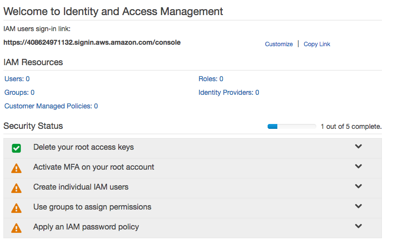
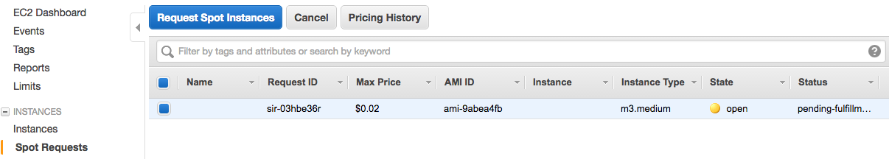
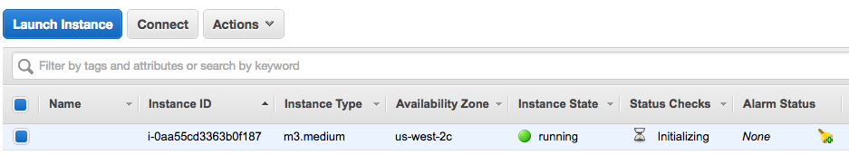

<a name="demo"></a>
## AWS Command Line [AWSCLI] (5 min)

Wow, great! We have learned to request and access computing power and storage as a service through AWS. Wouldn't it be nice to be able to do this in a quick way from the command line? Yeah! Let's introduce AWSCLI!

[AWSCLI](https://github.com/aws/aws-cli) is a unified command line interface to Amazon Web Services. It allows us to control most of AWS services from the same command line interface.

**Check:** Why is that useful? Why is that powerful? Can you give some examples?
> e.g. to be able to programatically turn instances on and off or to create complex architectures or to provision clusters in response to a demand

<a name="ind-practice"></a>
## AWS Command Line [AWSCLI] (15 min)

Let's go ahead and follow the [tutorial for AWSCLI](https://aws.amazon.com/getting-started/tutorials/backup-to-s3-cli/)


### Steps to complete

#### Step 1: Create an AWS IAM User

In order to use the command line we will have to configure a set of access credentials on our laptop. It's very important to create a separate identity with limited permissions instead of using our root account credentials.

**Check:** why is this so important?
> Answer: so that we can limit the damage a user could do if he/she were to obtain our credentials



**Note:** It's also probably a very good idea to set up 2-Factor Authentication!

**Note:** When attaching a Policy you can be more restrictive and only give the user permission to use the services you intend him/her to use.


#### Step 2: Install and Configure the AWS CLI


http://docs.aws.amazon.com/cli/latest/userguide/installing.html

Note that one of the method is to simply use `pip` to install the AWSCLI.

**Note:** If you already have AWSCLI configured and you would like to have multiple roles, you can do that as explained [here](http://docs.aws.amazon.com/cli/latest/userguide/cli-roles.html).

#### Step 3: Using the AWS CLI with Amazon S3

Now you can go ahead and copy files back and forth from your command line, without ever having to click on the web interface. How cool is that?


Here's a [Cheat Sheet](https://github.com/toddm92/aws/wiki/AWS-CLI-Cheat-Sheet) for the AWSCLI.

<a name="guided_practice"></a>
## EC2 from the command line (15 min)

Empowered with a well configured AWSCLI, we can now start and stop EC2 instances from the command line! Let's use it to spin up a spot instance.

#### 1. Check prices

Let's check the price for an `m3.medium` spot instance:

```bash
aws ec2 describe-spot-price-history \
    --start-time $(date -u +"%Y%m%dT%H0000") \
    --product "Linux/UNIX" \
    --instance-type "m3.medium" \
    --region us-west-2 \
    --output table
```

**Note:** you may have to set the region to the same region you used when opening your account.

```bash
-------------------------------------------------------------------------------------------------------
|                                      DescribeSpotPriceHistory                                       |
+-----------------------------------------------------------------------------------------------------+
||                                         SpotPriceHistory                                          ||
|+------------------+---------------+---------------------+------------+-----------------------------+|
|| AvailabilityZone | InstanceType  | ProductDescription  | SpotPrice  |          Timestamp          ||
|+------------------+---------------+---------------------+------------+-----------------------------+|
||  us-west-2b      |  m3.medium    |  Linux/UNIX         |  0.009700  |  2016-05-30T00:48:11.000Z   ||
||  us-west-2b      |  m3.medium    |  Linux/UNIX         |  0.009800  |  2016-05-30T00:45:56.000Z   ||
||  us-west-2a      |  m3.medium    |  Linux/UNIX         |  0.011100  |  2016-05-30T00:40:35.000Z   ||
||  us-west-2a      |  m3.medium    |  Linux/UNIX         |  0.011000  |  2016-05-30T00:35:39.000Z   ||
||  us-west-2b      |  m3.medium    |  Linux/UNIX         |  0.009900  |  2016-05-30T00:35:39.000Z   ||
||  us-west-2b      |  m3.medium    |  Linux/UNIX         |  0.010000  |  2016-05-30T00:30:46.000Z   ||
||  us-west-2b      |  m3.medium    |  Linux/UNIX         |  0.009800  |  2016-05-30T00:25:24.000Z   ||
||  us-west-2a      |  m3.medium    |  Linux/UNIX         |  0.011100  |  2016-05-30T00:22:38.000Z   ||
||  us-west-2a      |  m3.medium    |  Linux/UNIX         |  0.011200  |  2016-05-30T00:17:14.000Z   ||
||  us-west-2b      |  m3.medium    |  Linux/UNIX         |  0.009900  |  2016-05-30T00:14:46.000Z   ||
||  us-west-2a      |  m3.medium    |  Linux/UNIX         |  0.011100  |  2016-05-30T00:14:46.000Z   ||
||  us-west-2a      |  m3.medium    |  Linux/UNIX         |  0.010900  |  2016-05-30T00:11:47.000Z   ||
||  us-west-2a      |  m3.medium    |  Linux/UNIX         |  0.011000  |  2016-05-30T00:09:35.000Z   ||
||  us-west-2a      |  m3.medium    |  Linux/UNIX         |  0.010900  |  2016-05-30T00:06:52.000Z   ||
||  us-west-2a      |  m3.medium    |  Linux/UNIX         |  0.011000  |  2016-05-30T00:02:05.000Z   ||
||  us-west-2b      |  m3.medium    |  Linux/UNIX         |  0.009800  |  2016-05-29T23:49:30.000Z   ||
||  us-west-2a      |  m3.medium    |  Linux/UNIX         |  0.011100  |  2016-05-29T23:49:30.000Z   ||
||  us-west-2c      |  m3.medium    |  Linux/UNIX         |  0.013500  |  2016-05-29T01:14:22.000Z   ||
|+------------------+---------------+---------------------+------------+-----------------------------+|
```

#### 2. Get the Security group id

In the previous activity we launched an instance and created a security group that allows SSH access. Let's use the same security group.

```bash
aws ec2 describe-security-groups --region us-west-2
```
(or the region you chose)

This will return a json string. You want to copy the id of the security group that has port 22 open.

#### 3. Get the AMI id

Get the AMI id of the Ubuntu Linux 14.04 Image. You can find by checking the name in the [launch instance window](https://us-west-2.console.aws.amazon.com/ec2/v2/home?region=us-west-2#LaunchInstanceWizard). At the time of writing it's: `ami-9abea4fb`.

You can check it by typing:

```bash
aws ec2 describe-images --image-ids ami-9abea4fb --region us-west-2
```


#### 4. Launch spot instance

You're now ready to sumbit the spot instance request:

```bash
aws ec2 request-spot-instances \
    --region us-west-2 \
    --spot-price 0.02 \
    --launch-specification "{
        \"KeyName\": \"MyFirstKey\",
        \"ImageId\": \"<MOST RECENT UBUNTU AMI ID>\",
        \"InstanceType\": \"m3.medium\" ,
        \"SecurityGroupIds\": [\"<YOUR SECURITY GROUP ID>\"]
    }"
```

If working this should return a json description of the instance request.

You can check that the instance request has been opened:



or by command line:

```bash
aws ec2 describe-spot-instance-requests --region us-west-2
```

When the request has been accepted, an instance is spawned:



Let's retrieve the DNS name:
```bash
aws ec2 describe-instances --region us-west-2 --output json | grep PublicDnsName | head -n 1
```

#### 4. Connect to the spot instance

```bash
ssh -i ~/.ssh/MyFirstKey.pem ubuntu@<YOUR INSTANCE DNS>
```

#### 5. Terminate the spot instance

Let's retrieve the instance id and kill it:

```bash
aws ec2 describe-instances --region us-west-2 --output json | grep InstanceId

aws ec2 terminate-instances --instance-ids i-0aa55cd3363b0f187
```


