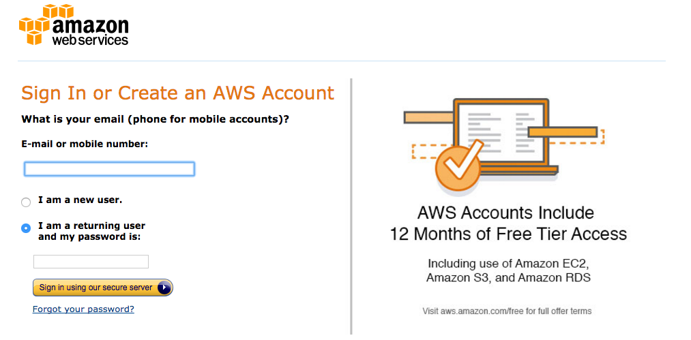
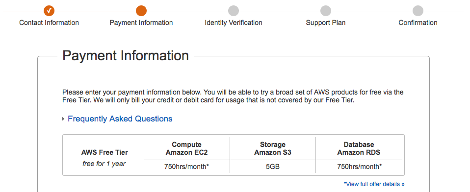
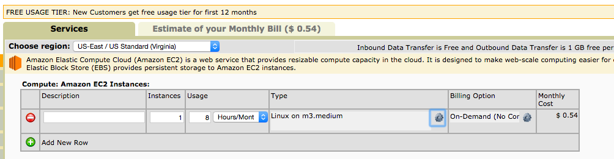

#  AWS: Amazon Web Services

### LEARNING OBJECTIVES
*After this lesson, you will be able to:*
- explain what services AWS offers and which ones are relevant to data science
- start and terminate an EC2 instance in the cloud
- store and download data from an S3 bucket

We'll need to first verifyhttps://aws.amazon.com/console/

https://aws.amazon.com/console/

## Overview

## Opening

Today we are going to discover Amazon Web Services. In particular we will focus on those services that are mostly used in Data Science. AWS are cloud computing services, essentially virtual machines somewhere in a datacenter that you can access and pay only for the time you need them.

**Check:** What is a server?
> Answer: A server is a computer or software that performs administration or coordination functions within a network.

**Check:** What did the world look like before AWS and Google cloud?
> Answer: computation was expensive to set up, to access and to maintain => only large companies, governments and institutions had access to it. Now anyone can rent it for pennies.

## Intro to AWS (10 min)
_Amazon Web Services (AWS)_, is a subsidiary of Amazon.com, which offers a suite of cloud computing services that make up an on-demand computing platform. These services operate from 12 geographical regions across the world. The most central and best-known of these services arguably include Amazon Elastic Compute Cloud, also known as "EC2", and Amazon Simple Storage Service, also known as "S3". AWS now has more than 70 services that span a wide range including compute, storage, networking, database, analytics, application services, deployment, management, mobile, developer tools and tools for the Internet of things. Amazon markets AWS as a service to provide large computing capacity quicker and cheaper than a client company building an actual physical server farm. _(from wikipedia)_

Today we will explore two services that are relevant to a lot of big-data scenarios.

We'll start by walking through [AWS services](https://www.expeditedssl.com/aws-in-plain-english).

1. EC2 (Elastic Compute Cloud)
- S3 (Simple Storage Service)

By the end of today you will be able to start and stop a computer in the cloud and to store data in the cloud. How cool is that!?

**Check:** What could be some advantages of using a server in the cloud instead of managing our own data center?
>
- Cost reduction: don't pay infrastructure costs when you don't need it
- Reliability: Servers are maintained and guaranteed by a company whose only job is to make sure they are available for you
- Scalability: Can add more computing power when necessary

## Demo: Elastic Compute Cloud [EC2] (5 min)

> Instructor note: All the following guided practices could be done as pair-programming exercises or as guided practices. You can decided to pair up students if you feel the class may benefit from it.

The first service we will discover is _Elastic Compute Cloud_ or _EC2_. This service forms a central part of Amazon.com's cloud-computing platform by allowing users to rent virtual computers on which to run their own computer applications. Let's learn some terms first:

- **Instance**: virtual machine hosted in Amazon Cloud running the software we want
- **Amazon Machine Image (AMI)**: a snapshot of a configured machine that we can use as starting point to boot an instance. We can also save a running instance to a new AMI so that in the future we can boot a new machine with identical configuration.
- **SSH Key**: [pair of keys](https://en.wikipedia.org/wiki/Public-key_cryptography) necessary to connect to an instance remotely. The private key will be downloaded to our laptop, the matching public key will be automatically configured on the instance.

The main conceptual shift from using a laptop to running an instance in the cloud is that we should think of computing power as ephemeral. We can request computing power when we need it, do a calculation and dismiss that power as we are done. Input and output will not be stored on the machine, rather stored somewhere else in the cloud (hint: S3). In this sense, computing power is a commodity that we purchase and use in the amount and time that we need.

Let's see how it works.

1) Create a new account on AWS [here](https://aws.amazon.com/)

It will ask you for contact information and credit card. Do not worry, most of the thing we will do are free for first time users and when we will use paying services it won't likely cost more than 10$.

Here are some screenshots of the process:

Once you're done you should get to this page:

Let's sign in to the console, you should get to this page:

## Elastic Compute Cloud [EC2] (15 min)

Let's go ahead and follow the [tutorial for EC2](https://aws.amazon.com/getting-started/tutorials/launch-a-virtual-machine/).

### Steps to complete:

#### Step1: Launch an Amazon EC2 Instance

#### Step2: Configure your Instance

Follow the suggested steps until you see your image booting up:

Notice that we can have a lot of information about the instance, in particular:

- it's DNS name and IP address
**Check:** What is an IP address?
> Answer: It's the address at which we can reach our machine
- They type of instance
- The key necessary to connect

#### Step 3: Connect to your Instance

Go ahead and follow the instructions on how to connect to the instance. In particular:

1. (optional) download a bash shell
- copy the SSH key you downloaded to the appropriate location
- use the SSH key to connect as explained in the tutorial

Congratulations!! You've just connected to an instance in the cloud!! How awesome is that!!

Try launching python from the shell and do something with it.

#### Step 4: Terminate Your Instance

Once you're done with your calculation and you no longer need the instance, you can go ahead and terminate it. NB: this will kill the instance and it will no longer be available to you. You should make sure you have saved all the data and the code you needed somewhere else.

Unless you are using your machine to serve a live application (like a web app or an api) it's very important that you terminate your instance if you don't use it so that you don't incur in additional unnecessary costs.

> Instructor note: make sure everyone has terminated their instance, destroyed any EBS allocated storage and emptied their S3 space, so that they don't get charged for anything unknowingly.

### Additional remarks

We've seen the simplest way to launch and terminate an instance in the cloud.

There's a lot more to it, that you'll discover in time, here are some pointers you may find useful:

- [Pricing](https://aws.amazon.com/ec2/pricing/): EC2 pricing depends on the type of instance and on the chosen region. Make sure you understand the cost of the instance you request in order to avoid surprise bills. If you're in doubt you can use the convenient [Cost Calculator](http://calculator.s3.amazonaws.com/index.html) to get an exact forecast of your costs.

- [Spot instances](http://docs.aws.amazon.com/AWSEC2/latest/UserGuide/using-spot-instances.html): spot instances are even more ephemeral than normal instances. They only live till their cost is lower than the price you agreed to pay. They are a great way to save money when using more powerful machines.
- [AMIs](http://docs.aws.amazon.com/AWSEC2/latest/UserGuide/AMIs.html) AMIs are shapshot of our machine. They are great if we installed a lot of software on our machine and want to save that particular configuration.

**Check:** can you give an example of when AMIs could be useful?
> Answer: e.g. if we have downloaded and installed Anaconda Python

- [Security Groups](http://docs.aws.amazon.com/AWSEC2/latest/UserGuide/using-network-security.html): security groups are ways to open ports to the services running on our machine.
**Check:** can you give an example of a practical case?
> Answer: e.g. if we are running IPython notebook on the instance and want to reach it from a browser.

- [Elastic IPs](http://docs.aws.amazon.com/AWSEC2/latest/UserGuide/elastic-ip-addresses-eip.html): we can rent a fixed IP address and associate it to our instance. This way we can configure tools to always connect to the same address, independently of which machine is behind it.
**Check:** can you give a practical use case?
> Answer: e.g. if we want to automate ssh connection with a configuration file.

## Simple Storage Service [S3] 

We have learned how to start and stop an instance in the cloud. That's great, because it gives us "computing power as a service". Now let's learn how we can store data in the cloud too.

Amazon S3 (Simple Storage Service) is an online file storage. It provides storage through web services interfaces (REST, SOAP, and BitTorrent) using an _object storage architecture_. According to Amazon, S3's design aims to provide scalability, high availability, and low latency at commodity costs.

Objects are organized into buckets (each owned by an Amazon Web Services account), and identified within each bucket by a unique, user-assigned key. Buckets and objects can be created, listed, and retrieved using either a REST-style HTTP interface or a SOAP interface. Additionally, objects can be downloaded using the HTTP GET interface and the BitTorrent protocol.

## Simple Storage Service [S3] 

In pairs: go ahead and follow the [tutorial for S3](https://aws.amazon.com/getting-started/tutorials/backup-files-to-amazon-s3/).

The steps should be super simple to follow. Any questions?

**Check:** what's a practical case you can envision using S3 for?
> Answer: storing input dataset, storing result tables. It's like Dropbox

## Note on AWS CLI

Working with the graphical user interface is nice, but we may want to work with our instances from the command line for efficiency as well as programmatically. This [independent practice guide](aws-cli.md) provides the ability to do this exactly.

## Conclusion (5 min)

In this lesson we have learned about 2 fundamental Amazon web services: Elastic Cloud Compute and Simple Storage Service. These 2 services are so common because they provide on demand computation and storage at a very affordable cost.

We have learned how to use them both from the web interface and from the command line.

**Check:** can you think of a situation where this could be useful?
> Have them reflect on availability of data from multiple terminals, and availability of much greater computing power and storage capacity than a laptop.

### ADDITIONAL RESOURCES

- A rundown of [AWS services](https://www.expeditedssl.com/aws-in-plain-english)
- [EC2](https://aws.amazon.com/ec2/?nc2=h_m1)
- [S3](https://aws.amazon.com/s3/?nc2=h_m1)
- [Tutorials](https://aws.amazon.com/getting-started/tutorials/)
- [AWS CLI Tutorial](http://www.joyofdata.de/blog/guide-to-aws-ec2-on-cli/)
- [Google Cloud](https://cloud.google.com/datalab/docs/quickstarts/quickstart-gce)
- [Neural Network Art](https://github.com/andersbll/neural_artistic_style) or using Google's [DeepDream](http://www.makeuseof.com/tag/create-neural-paintings-deepstyle-ubuntu/) to do this
- [Stanford's CS231 GPU Setup Guide](http://cs231n.github.io/aws-tutorial/)
- [Google Pricing Scheme](https://cloud.google.com/compute/pricing)

